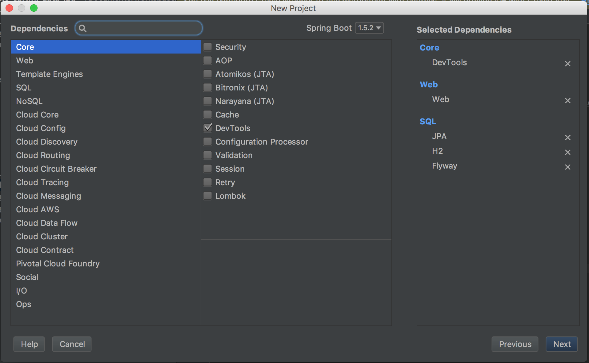
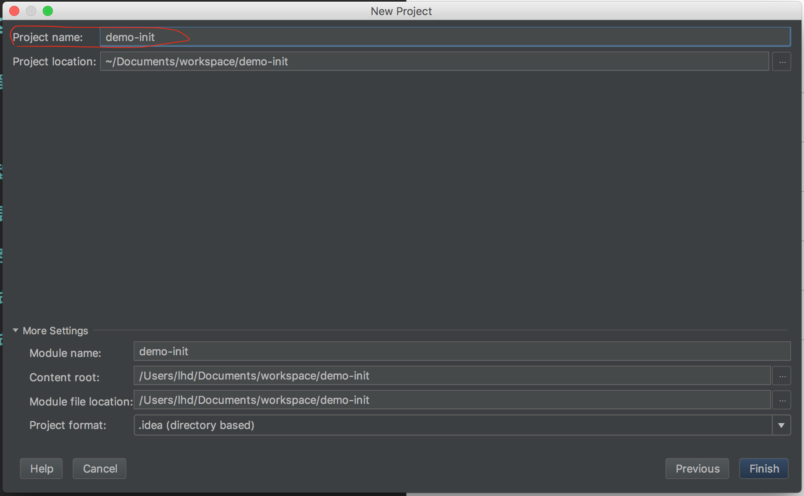

# Spring Data JPA 教程


## 创建工程

* 打开 IntelliJ IDEA， 选择创建新工程:


* 选择Spring Initializr:


* 选择DevTools，Web，JPA，H2:


* 输入工程信息:


* 进入工程页面:


到此，我们就创建了一个Spring Boot工程。

## 创建模型

接下来，我们创建接入数据的基础模型，首先创建一个package: cn.sia.demo.springdata.jpa.domain.model

### 创建公司模型
在cn.sia.demo.springdata.jpa.domain.model包中创建Company.java文件。

```
package cn.sia.demo.springdata.jpa.domain.model;

import javax.persistence.*;
import java.util.ArrayList;
import java.util.Collection;


@Entity
public class Company {

	@Id
	private Long id;
	private String name;

	@OneToMany(mappedBy = "company")
	private Collection<Person> employees = new ArrayList<>();

	public Company() {
	}

	public Company(Long id, String name) {
		this.id = id;
		this.name = name;
	}

	public Long getId() {
		return id;
	}

	public void setId(Long id) {
		this.id = id;
	}

	public String getName() {
		return name;
	}

	public void setName(String name) {
		this.name = name;
	}
}
```

这是一个基本的@Entity模型，@Id表示主键，默认构造函数是JPA必须的，另外我们声明了一系列的accessor方法。@OneToMany表示一个company可以对应多个用户，mappedBy表示反向映射，这样我们就可以从Company对象中找到Person。


### 创建部门模型

在cn.sia.demo.springdata.jpa.domain.model包中创建Department.java文件。

```
package cn.sia.demo.springdata.jpa.domain.model;

import javax.persistence.Entity;
import javax.persistence.Id;
import javax.persistence.OneToMany;
import java.util.ArrayList;
import java.util.Collection;

@Entity
public class Department {
	@Id
	private Long id;
	private String name;

	@OneToMany(mappedBy = "department")
	private Collection<Person> employees = new ArrayList<>();

	public Department() {
	}

	public Department(Long id, String name) {
		this.id = id;
		this.name = name;
	}

	public Long getId() {
		return id;
	}

	public void setId(Long id) {
		this.id = id;
	}

	public String getName() {
		return name;
	}

	public void setName(String name) {
		this.name = name;
	}
}
```

### 创建人员模型

在cn.sia.demo.springdata.jpa.domain.model包中创建Department.java文件。

```
package cn.sia.demo.springdata.jpa.domain.model;

import javax.persistence.*;
import java.util.Date;

@Entity
public class Person {
	@Id
	private Long id;
	private String name;
	private Date birthday;

	public Company getCompany() {
		return company;
	}

	public void setCompany(Company company) {
		this.company = company;
	}

	public Department getDepartment() {
		return department;
	}

	public void setDepartment(Department department) {
		this.department = department;
	}

	private Gender gender;
	private String phone;

	@ManyToOne
	private Company company;

	@ManyToOne
	private Department department;


	public Person() {
	}

	public Person(Long id, String name, Date birthday, Gender gender, String phone, Company company, Department department) {
		this.id = id;
		this.name = name;
		this.birthday = birthday;
		this.gender = gender;
		this.phone = phone;
		this.company = company;
		this.department = department;
	}

	public Long getId() {
		return id;
	}

	public void setId(Long id) {
		this.id = id;
	}

	public String getName() {
		return name;
	}

	public void setName(String name) {
		this.name = name;
	}

	public Date getBirthday() {
		return birthday;
	}

	public void setBirthday(Date birthday) {
		this.birthday = birthday;
	}

	public Gender getGender() {
		return gender;
	}

	public void setGender(Gender gender) {
		this.gender = gender;
	}

	public String getPhone() {
		return phone;
	}

	public void setPhone(String phone) {
		this.phone = phone;
	}
}
```

一个Department可以对应多个Person，一个Company同样可以对应多个Person，所以这里写的是@ManyToOne

## 创建数据仓库

有了基本的业务对象模型之后，我们就可以创建repository，进行数据库操作。
创建cn.sia.demo.springdata.jpa.domain.repository包。

### 创建Company仓库

在cn.sia.demo.springdata.jpa.domain.repository包下创建CompanyRepository.java接口

```
package cn.sia.demo.springdata.jpa.domain.repository;

import org.springframework.data.repository.CrudRepository;
import cn.sia.demo.springdata.jpa.domain.model.Company;

public interface CompanyRepository extends CrudRepository<Company, Long> {
	Company findByName(String name);
}
```

repository是数据库的接口，继承自CrudRepository，包含了诸如save, delete, findOne, findAll等方法。通过Spring Data JPA，这个接口同样可以实现一些基础的查询功能，比如通过属性查询：findByATTR()。例如，这里我们定义了 public findByName(String name), 通过Spring Data JPA，它可以自动实现这个方法，我们就不必具体提供query实现了。

### 创建Department仓库

在cn.sia.demo.springdata.jpa.domain.repository包下创建DepartmentRepository.java接口

```
package cn.sia.demo.springdata.jpa.domain.repository;

import org.springframework.data.repository.CrudRepository;
import cn.sia.demo.springdata.jpa.domain.model.Department;

public interface DepartmentRepository extends CrudRepository<Department, Long>{

}
```

### 创建Person仓库

在cn.sia.demo.springdata.jpa.domain.repository包下创建PersonRepository.java接口

```
package cn.sia.demo.springdata.jpa.domain.repository;

import org.springframework.data.jpa.repository.Query;
import org.springframework.data.repository.CrudRepository;
import cn.sia.demo.springdata.jpa.domain.model.Company;
import cn.sia.demo.springdata.jpa.domain.model.Person;

import java.util.Date;
import java.util.List;

public interface PersonRepository extends CrudRepository<Person, Long> {

	@Query(value = "SELECT * FROM person WHERE NAME LIKE ?1%", nativeQuery = true)
	List<Person> findByLastName(String lastName);
	
	List<Person> findByBirthdayBefore(Date date);

	List<Person> findByCompany(Company company);
}
```

## 创建服务

接下来，我们对这些数据操作功能进行服务封装，创建cn.sia.demo.springdata.jpa.service包

### 创建CompanyService

在cn.sia.demo.springdata.jpa.service包下创建CompanyService.java

```
package cn.sia.demo.springdata.jpa.service;

import org.springframework.beans.factory.annotation.Autowired;
import org.springframework.stereotype.Service;
import org.apache.log4j.Logger;

import cn.sia.demo.springdata.jpa.domain.model.Company;
import cn.sia.demo.springdata.jpa.domain.repository.CompanyRepository;

import java.util.ArrayList;
import java.util.List;

@Service
public class CompanyService implements BaseService {

	private Logger logger = Logger.getLogger(getClass());

	@Autowired
	private CompanyRepository cr;

	public boolean create(Long id, String name) {

		if(cr.save(new Company(id, name)) == null) {
			logger.error("create company operation failed.");
			return false;
		}

		logger.info("create company operation success.");
		return true;
	}

	public List<Company> searchAll() {
		List<Company>companies = new ArrayList<>();
		cr.findAll().forEach(companies::add);
		return companies;
	}

	public boolean remove(Long id) {
		if(cr.findOne(id) == null) return false;
		cr.delete(id);
		return true;
	}

	public boolean modify(Long id, Company com) {
		Company c = cr.findOne(id);
		if(c == null) return false;

		if(!com.getName().isEmpty()) {
			if(com.getName().equals(c.getName())) {
				return false;
			} else {
				c.setName(com.getName());
				cr.save(c);
				return true;
			}
		} else {
			return false;
		}
	}

	public Company search(Long id) {
		return cr.findOne(id);
	}
}
```

### 创建DepartmentService

在cn.sia.demo.springdata.jpa.service包下创建DepartmentService.java

```
package cn.sia.demo.springdata.jpa.service;

import org.apache.log4j.Logger;
import org.springframework.beans.factory.annotation.Autowired;
import org.springframework.stereotype.Service;

import cn.sia.demo.springdata.jpa.domain.model.Department;
import cn.sia.demo.springdata.jpa.domain.repository.DepartmentRepository;

import java.util.ArrayList;
import java.util.List;

@Service
public class DepartmentService implements BaseService {

	private Logger logger = Logger.getLogger(getClass());

	@Autowired
	private DepartmentRepository dr;

	public boolean create(Long id, String name) {

		if(dr.save(new Department(id, name)) == null) return false;

		return true;
	}

	public List<Department> searchAll() {
		List<Department>companies = new ArrayList<>();
		dr.findAll().forEach(companies::add);
		return companies;
	}

	public boolean remove(Long id) {
		if(dr.findOne(id) == null) return false;
		dr.delete(id);
		return true;
	}

	public boolean modify(Long id, Department com) {
		Department c = dr.findOne(id);
		if(c == null) return false;

		if(!com.getName().isEmpty()) {
			if(com.getName().equals(c.getName())) {
				return false;
			} else {
				c.setName(com.getName());
				dr.save(c);
				return true;
			}
		} else {
			return false;
		}
	}

	public Department search(Long id) {
		return dr.findOne(id);
	}
}
```
Service功能仅仅是对数据库操作功能的封装，实现更高层次的逻辑功能。CompanyService中，我们实现了对Company的增删改查。通过@Autowired，我们向这个服务注入了一个CompanyRepository对象，我们使用这个对象进行Company数据操作。

### 创建PersonService

在cn.sia.demo.springdata.jpa.service包下创建PersonService.java

```
package cn.sia.demo.springdata.jpa.service;

import org.apache.log4j.Logger;
import org.springframework.beans.factory.annotation.Autowired;
import org.springframework.stereotype.Service;
import cn.sia.demo.springdata.jpa.domain.model.Company;
import cn.sia.demo.springdata.jpa.domain.model.Department;
import cn.sia.demo.springdata.jpa.domain.model.Gender;
import cn.sia.demo.springdata.jpa.domain.model.Person;
import cn.sia.demo.springdata.jpa.domain.repository.CompanyRepository;
import cn.sia.demo.springdata.jpa.domain.repository.DepartmentRepository;
import cn.sia.demo.springdata.jpa.domain.repository.PersonRepository;

import java.util.ArrayList;
import java.util.Date;
import java.util.List;

@Service
public class PersonService implements BaseService {

	private Logger logger = Logger.getLogger(getClass());

	@Autowired
	private PersonRepository pr;

	@Autowired
	private CompanyRepository cr;

	@Autowired
	private DepartmentRepository dr;

	public List<Person> searchAll() {
		List<Person> people = new ArrayList<>();
		pr.findAll().forEach(people::add);
		return people;
	}

	public Person search(Long id) {
		Person p = pr.findOne(id);
		return p;
	}

	public boolean create(Long id, String name, Date birthday,
	                      Gender gender, String phone, Long companyId,
	                      Long departmentId) {

		if(cr.findOne(id) != null) return false;

		Company company = cr.findOne(companyId);
		if(company == null) return false;

		Department department = dr.findOne(departmentId);
		if(department == null) return false;

		if(pr.save(new Person(id, name, birthday, gender, phone, company, department)) == null) return false;

		return true;
	}

	public boolean modify(Long id, String name, Date birthday,
	                      Gender gender, String phone, Long companyId,
	                      Long departmentId) {
		Person p = pr.findOne(id);
		if(p == null) return false;

		Company c = cr.findOne(companyId);
		if(c == null) return false;

		Department d = dr.findOne(departmentId);
		if(d == null) return false;

		Person np = new Person(id, name, birthday, gender, phone, c, d);
		if(pr.save(np) == null) return false;

		return true;
	}

	public boolean remove(Long id) {
		if(pr.findOne(id) == null) return false;

		pr.delete(id);
		return true;
	}

	public List<Person> findByLastName(String lastName) {
		List<Person> people = pr.findByLastName(lastName);
		return people;
	}

	public List<Person> findByBirthdayBefore(Date date) {
		List<Person> people = pr.findByBirthdayBefore(date);
		return people;
	}

	public List<Person> findByCompany(String companyName) {
		Company c = cr.findByName(companyName);
		if(c == null) return null;

		List<Person> employees =  pr.findByCompany(c);
		return employees;
	}
}
```

## 简单测试

### 修改DemoApplication文件
接下来我们进行简单的测试编写，修改cn.sia.demo.springdata.jpa包下的DemoApplication.java文件：

```
package cn.sia.demo.springdata.jpa;

import org.springframework.boot.CommandLineRunner;
import org.springframework.boot.SpringApplication;
import org.springframework.boot.autoconfigure.SpringBootApplication;
import org.springframework.context.annotation.Bean;
import cn.sia.demo.springdata.jpa.domain.model.Person;
import cn.sia.demo.springdata.jpa.domain.repository.CompanyRepository;
import cn.sia.demo.springdata.jpa.domain.repository.DepartmentRepository;
import cn.sia.demo.springdata.jpa.domain.repository.PersonRepository;

import java.util.Date;
import java.text.SimpleDateFormat;

import java.util.List;

@SpringBootApplication
public class DemoApplication {

	public static void main(String[] args) {
		SpringApplication.run(DemoApplication.class, args);
	}

	@Bean
	CommandLineRunner demo(CompanyRepository cr, DepartmentRepository dr, PersonRepository pr) {
		return (args) -> {
			List<Person> people = pr.findByLastName("wang");

			System.out.println("DEBUG: start to print out names with last name : wang");
			people.forEach(person -> System.out.println(person.getName()));


			System.out.println("DEBUG: start to print out people whose birthday is earlier than 1985-01-01");

			SimpleDateFormat sdf = new SimpleDateFormat("yyyy-MM-dd");
			Date date = sdf.parse("1985-01-01");

			System.out.println(date.toString());
			List<Person> p = pr.findByBirthdayBefore(date);
			p.forEach(person -> System.out.println(person.getName() + " " + person.getBirthday().toString()));

		};
	}
}
```

这里我们注入了一个CommandLineRunner Bean，在这个Bean的回调函数中，我们注入了三个repository，在函数体中，我们进行Person查找，以及过滤函数的调用。

### 配置运行
* 选择Run->Edit Configurations
* 添加Spring Boot配置
* 选择Main class以及classpath module


配置好之后，我们就可以运行,可以看到控制台输出了相应的log:


## 编写测试

### 创建测试
在test/java下创建cn.sia.demo.springdata.jpa.service包，
在该包中创建CompanyServiceTests.java

```
package cn.sia.demo.springdata.jpa.service;

import static org.hamcrest.core.Is.is;
import static org.junit.Assert.assertEquals;
import static org.junit.Assert.assertThat;

import org.junit.Test;
import org.junit.runner.RunWith;
import org.springframework.beans.factory.annotation.Autowired;
import org.springframework.boot.test.context.SpringBootTest;
import org.springframework.test.context.junit4.SpringRunner;
import cn.sia.demo.springdata.jpa.domain.model.Company;

import java.util.List;

@RunWith(SpringRunner.class)
@SpringBootTest
public class CompanyServiceTests {

	@Autowired
	private CompanyService cs;


	/*
	 * test case: add new company
	 * verify company creation service return true.
	 * verify company size.
	 */
	@Test
	public void addCompany() throws Exception {

		List<Company> companies = cs.searchAll();
		int originalCompanySize = companies.size();

		boolean res = cs.create(7L, "newCompany");
		assertThat(res, is(true));

		companies = cs.searchAll();
		assertEquals(originalCompanySize+1, companies.size());
	}

	/*
	 * test case: delete a company.
	 * verify company remove method execution.
	 * verify the size of company
	 */
	@Test
	public void removeCompany() throws Exception {

		List<Company> companies = cs.searchAll();
		int origSize = companies.size();

		boolean res = cs.remove(7L);
		assertEquals(true, res);

		companies = cs.searchAll();
		assertThat(companies.size(), is(origSize-1));
	}


	/*
	 * test case: modify a company.
	 * change a company name, then verify the company name changed.
	 */
	@Test
	public void modifyCompany() throws Exception {

		Company com = new Company(1L, "newCompany");
		boolean res = cs.modify(1L, com);
		assertEquals(true, res);
		com = cs.search(1L);
		assertEquals(true, com != null);
		assertEquals("newCompany", com.getName());
	}

	/*
	 * test case: find a company.
	 * find record 2, check the value.
	 */
	@Test
	public void searchCompany() throws Exception {
		Company c = cs.search(2L);
		assertThat(c != null, is(true));
	}
}
```

这里我们也是注入一个CustomerService对象，然后所有的测试都是通过CustomerService运行的。@Test表示一个测试。

### 运行测试

选择Run->Edit Configurations


配置好之后，我们可以运行测试,可以看到测试成功失败的测试用例：


### 查看code coverage

点击如图中所示的红圆圈中的按钮，我们可以查看当前测试的覆盖率：


